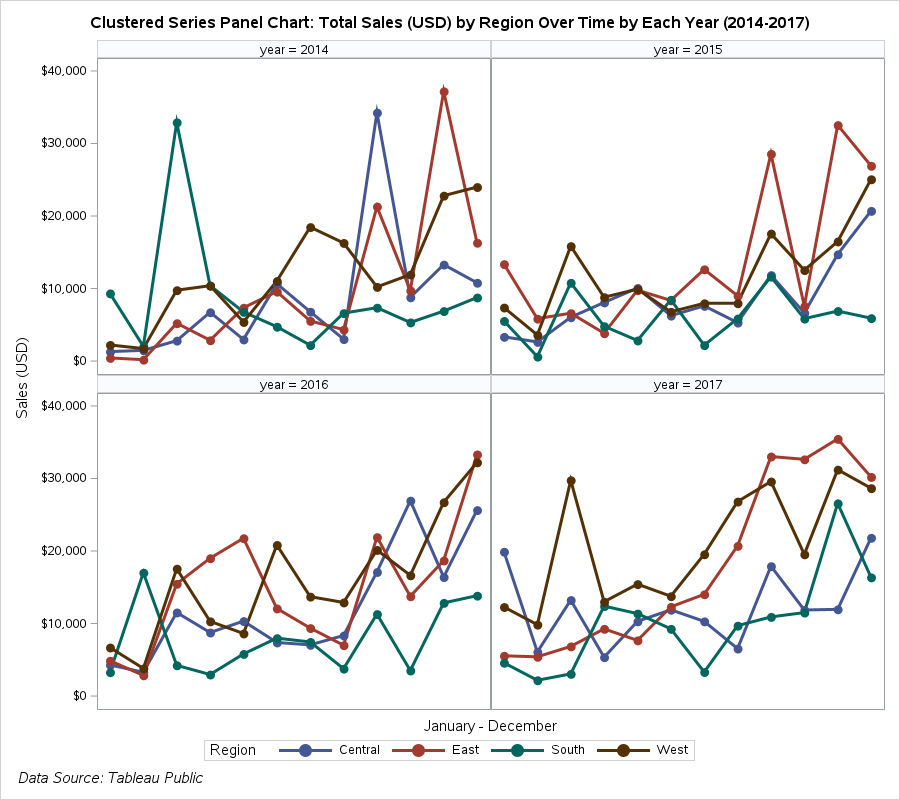

# Data Visualization with SAS

This repository is summarized through the readme. All of the plots were created using SAS Studio code. See full data source references at the bottom of the readme.

## Small Business Analysis Data 
A mock data set created by myself is used for the bubble plot demo. This is a data set with details about a small clothing resale business. 

### Bubble Plots 

First is a bubble plot of profit vs. sales for all clothing types by clothing niche (luxury, trendy, and vintage).

Next, the data is subset to look only at tops profit vs. Sales.

### Scatter Plots
Are scatter plots visually better for the data? This is a comparison from the bubble chart with the same data sets used before.

Scatter plot for all clothing types.

Scatter plot for just tops.

### Scatter Plots as a panel

How about scatter plot panels? Is this more aesthetically pleasing?

## Birth Data

### Box and Whisker Plots

