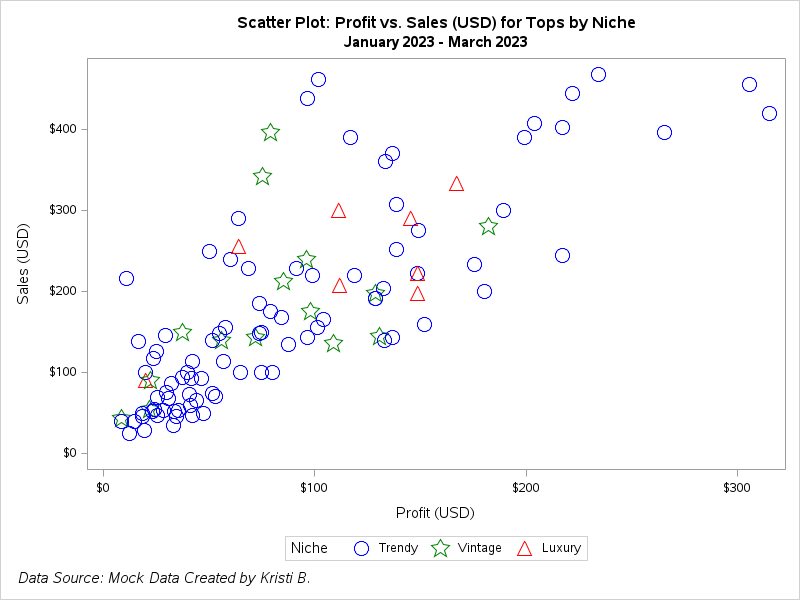
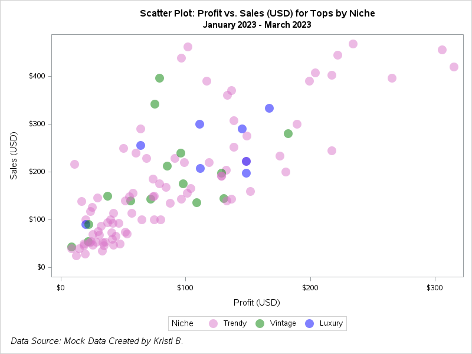
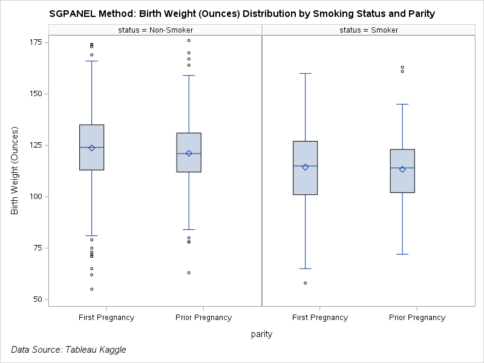
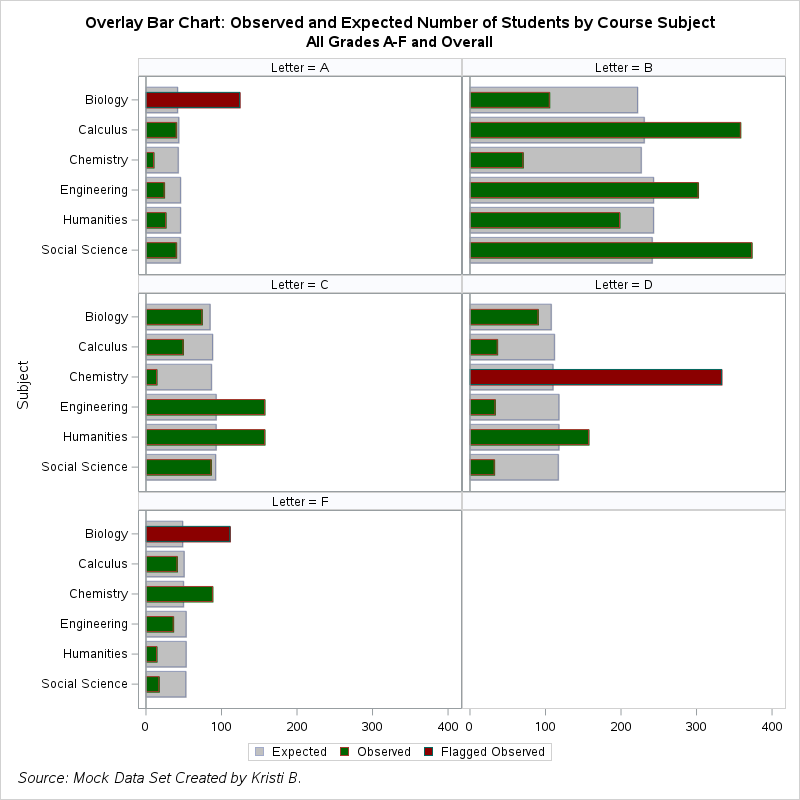

# Data Visualization with SAS

This repository is summarized through the readme. All of the plots were created using SAS Studio code. Some data sources were created by and are indicated in the readme sections below. See the end of the readme for data sources that I didn't create.

## Small Business Analysis Data 
A mock data set created by myself is used for the bubble and scatter plot demos. This is a data set with details about a small clothing resale business. 

### Bubble Plots 

First is a bubble plot of profit vs. sales for all clothing types by clothing niche (luxury, trendy, and vintage). Combining all clothing types makes it difficult to see a lot of the data points. Here, no colors are customized and the default is displayed.

Next, the data is subset to look only at tops profit vs. Sales. Customization to the bubbles includes transparency and color changes by niche category. 

### Scatter Plots

Are scatter plots or bubble plots visually better for the data? This is a comparison from the bubble chart with the same data sets used before. This scatter plot is for sales (USD) for tops by niche. Differentiation of the niche category is displayed by marker symbol and color, which is accomplished by attribute map.

This scatter plot using the same data as above, but it's simpler with a circle filled marker symbol and color customization by niche. 

## Birth Data
The birth data set was retrieved from [Kaggle](https://www.kaggle.com/datasets/debjeetdas/babies-birth-weight). This data set details birthweight analysis by mother and pregnancy in the San Fransisco East Bay Area 1960 - 1967.

### Scatter plots as a panel

Here is a scatter plot panel (2 columns and 1 row) that details mother weight (lbs.) vs. height (in.) by normal and low birthweight groups. Normal birthweight was categorized as 88 grams or above. 

### Box and Whisker Plots

Paneled box and whisker plot of the distribution of birth weight (ounces) by mother smoking status and parity.

Here is a version of the box and whisker plot without the panel. This option automatically changes the color between groups/categories.

An example of a heat map with mother weight (lbs.) vs. height (in.). Heat maps work best with a lot of data points. 

## Superstore Data
The superstore data is a mock data set available on [Tableau Public](https://public.tableau.com/app/resources/sample-data) that details customer orders from 2014 through part of 2018. 

## Bar Charts

Bar charts do not have to be boring. Colors can be modified, and there are various types of bar charts. This is a clustered bar chart of sales (USD) by customer type (segment) and product. 

A bit more data manipulation is applied to create a stacked column bar chart with multiple sales (USD) labels.

## Line and Series Charts

A basic line chart for profit (USD) over time, but the background color is customized using proc template. I especially like the line and marker color and thickness customization.

The line chart is further customized by grouping by region, so then there are 4 lines of data to follow. To differentiate the data by region, color is customized. Additionally, the line patterns are customized by region. This is useful in case color may not be used. Customizations were created by an attribute map. 

Panel is useful in this example when there is a lot of information to visualize. The plot details sales for each month grouped by region, and the panels are for each year. The year 2018 is excluded, because there was not enough months of data. 

A stacked band plot requires a lot of data compression (aggregation), but it's visually nice. Sales (USD) is detailed over time with each band and area chart component representing a product category.

## Academic Data
A mock data set created by myself. This data set includes grades and the calculated observed and expected number of students with these letter grades by popular course subjects. 

### Overlay and tornado graphs

Overlay graphs are great for observed and predicted values, and the fill attributes for the bars may be customized and conditional. A panel style is used for a clean look at the overlay graphs that represent each letter grade and course subject. There is an empty panel since there are only 5 letter grades. Using Chi Square calculation, there are some course subjects (depending on the letter grade) that are flagged as having a significant amount of students with that letter grade compared to the expected number of students. These bars are conditionally coded to be a dark red to stand out.  

The most extreme grades (A and F) are compared in a tornado chart. The overlay style is continued here in order to compare observed and expected values. Default colors may be used, or they can be customized to the color of choice as below.

#### Sources/Citations:
##### The birth data was made available and accessed on [Kaggle](https://www.kaggle.com/datasets/debjeetdas/babies-birth-weight) 
##### Superstore data made available and accessed on [Tableau Public](https://public.tableau.com/app/resources/sample-data)
